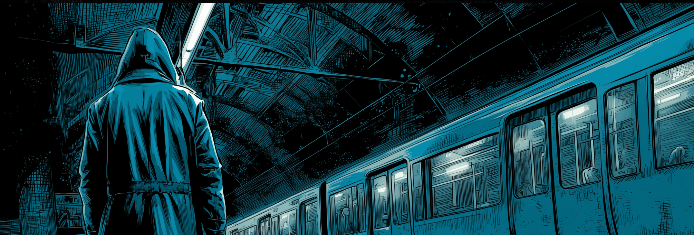

```{r}
#| include: false
set.seed(721831)
```

# Course Overview

## Learning Objectives

This guide aims to provide learners with the conceptual understanding and practical skills needed to import, clean, transform, and analyse Android log data using R and the tidyverse ecosystem. By the end of the module, learners should be able to transform raw device logs into meaningful analytical data sets suitable for behavioural, usability, or digital phenotyping studies.

This includes:

1.  Understanding the structure of Android log data, including key variables commonly found in app logs.
2.  Importing and preprocessing both already processed and raw Android log data using the tidyverse.
3.  Computing and visualising key usage measures such as visits, session durations and sequences.

## Target audience

This guide is designed for researchers, data analysts, and students who are interested in working with mobile sensing or digital trace data, particularly Android log files. It assumes a basic familiarity with R and the tidyverse ecosystem, including data manipulation with dplyr and data visualisation with ggplot2. Participants should already understand fundamental data analysis concepts and be ready to apply them to the challenges of preprocessing and analysing complex, time-based log data.

## Setting up the computational environment

Install the R packages.

```{r}
#| label: install-packages
#| eval: false
install.packages("dplyr")
install.packages("lubridate")
install.packages("tidyr")
install.packages("ggplot2")
install.packages("extrafont")
install.packages("forcats")
install.packages("stringr")
```

And load the R packages.

```{r}
#| message: false
library(dplyr)
library(lubridate)
library(tidyr)
library(ggplot2)
library(extrafont)
library(forcats)
library(stringr)
```

```{r}
#| message: false
# Effectively disable scientific notation
options(scipen = 999)
```

## Duration

You'll be able to complete the module in about half a day.

# Social Science Use Cases

This method has been used in previous studies to evaluate information usage of Fridays for Future supporters [e.g. @Zerrer2024], research on well-being [e.g. @Klingelhoefer2025] and smartphone usage patterns [e.g. @Toth2025].


# Some Context about Android App Log Data

Android app log data are automatically generated records that capture interactions between users, apps, and the operating system on Android devices. System services and applications record events such as app launches, screen on/off states, foreground and background transitions, notifications, and sensor activities. Each event is typically time-stamped and includes the event type, the app or process involved, and contextual metadata such as battery status, network connectivity, or user interactions. These digital traces allow researchers to reconstruct usage episodes in detail and study digital mobile behaviour.

# The red or blue pill?

Since the degree of preprocessing and thus the structure of app logging data can vary, we will look at two example cases. The first case is based on a data set that has already been preprocessed to a relatively high degree by a panel provider, thus providing a good introduction to some basic concepts in data analysis.

In reference to The Matrix, we call this the "blue" data set. For now, we will remain in the more comfortable world of convenient and rather well-preprocessed data structures. Later in the tutorial, however, we will turn to the "red" data set and confront the messy reality of raw event logs.

# The blue data set


Just a few brief notes on the blue data set. The data are based on one week of data collection from a German sample of Android users (N = 371) in 2021. For this tutorial, a smaller sub-sample (N = 50) was taken from the overall data set to ensure that the procedure presented here can be carried out on as wide a range of computers as possible.

Before any analysis can begin, it’s crucial to understand how the data is organised. A typical, more processed Android logging data set includes the following variables:

*panelist_id* – unique identifier for each user or device

*date* – the date of the recorded event

*start_time* - a timestamp indicating the start of an application

*end_time* - a timestamp indicating the end of an application

*duration* - the usage duration (in seconds or milliseconds) of the application

*app_name* – readable name of the application

*app_package* – the app’s identifier

**Note:** The variable names as well as the structure of your data set can vary based on the level of preprocessing and tracking app used.

## Common Dimensions of Analysis

We will use the blue data set to familiarise you with some conceptual decisions. However, in the course of the tutorial, we will use the red data set more to demonstrate the computational steps of data preparation. Nevertheless, these forthcoming conceptual decisions are also relevant for the red data set.

To make sense of app log data, analysts typically view it through several dimensions of analysis:

*Person-level* – patterns and metrics aggregated per individual or group.

*Temporal* – analyses over time (hourly, daily, weekly trends).

*App-level* – comparisons across apps (WhatsApp vs Telegram) or app categories (Entertainment vs Shopping).

*Combined perspectives* – mixing dimensions, such as app use over time or per user.

These general dimensions of comparison run through the entire analysis. Accordingly, it is important to consider at the beginning of the analysis what the results should show and on which of the dimensions of comparison they are based.

However, before we go through some analysis examples, our blue data set must undergo several preprocessing steps, even though it is already very well processed.

## Preprocessing the Blue Data Set

Raw log data often contains a large amount of noise from background processes and system apps that do not represent active user behaviour. In this step, we focus on data cleaning and filtering [@Zerrer2024], including:

*Removing background apps* – exclude system processes or apps running without direct user engagement.

*Merge consecutive visits to the same app* - sometimes apps are interrupted by system apps, which leads to a technical artefact that appears as a new app visit. To prevent these from being misinterpreted as human behaviour (e.g., as intentional app access), these cases are removed.

*Blacklisting apps* – recode or generalise apps that are irrelevant to the research question and are potentially sensitive (e.g., health apps, banking, etc.). We have prepared a preliminary list of blacklisted apps for this tutorial. You can find the script for this on GitHub (blacklisted_apps.qmd).

::: {.callout-note collapse="true" icon="false"}
**Ethics & Privacy**

When working with Android app logging data, care should be taken to effectively protect the privacy of participants. Here, personal identifiers in the raw data must be consistently pseudonymized and, if the purpose of the analysis allows, completely anonymised in order to rule out the re-identification of individual users. Furthermore, strict blacklisting of sensitive parameters or, preferably, whitelisting of only necessary events must be used to ensure that no unintended private content is logged. Finally, the data sets should be aggregated into statistical groups in order to obscure individual usage behaviour and focus on overarching trends. This is a very important but also extensive topic, which we cannot cover sufficiently in this tutorial, but we recommend the following literature:

*Spiekermann, S., & Cranor, L. F. (2008). Engineering privacy. IEEE Transactions on software engineering, 35(1), 67-82. [https://doi.org/10.1109/TSE.2008.88](https://doi.org/10.1109/TSE.2008.88)*

*Breuer, J., Bishop, L., & Kinder-Kurlanda, K. (2020). The practical and ethical challenges in acquiring and sharing digital trace data: Negotiating public-private partnerships. New Media & Society, 22(11), 2058-2080. [https://doi.org/10.1177/1461444820924622](https://doi.org/10.1177/1461444820924622)*
:::

```{r}
background_apps = read.csv("data/background_system_packages.csv") # based on Parry & Toth (2025) with some smaller extensions
blacklisted_apps = readRDS("data/blacklisted_apps.rds") %>% select(-app_package) %>% distinct(app_name, .keep_all = TRUE)
```

Let's import our blue data set.

```{r import data}
blue_data = readRDS("data/blue_data.rds") 
```

And have a quick look.

```{r}
glimpse(blue_data)
```

Now, let's remove background apps, replace sensitive apps, and convert temporal data to the correct timezone.

```{r}
blue_data_clean = blue_data %>% 
  
  # remove background app logs from our data set
  filter(!app_package %in% background_apps$pcn) %>% 
  
  # replace sensitive apps in your data set to strengthen anonymisation
  left_join(blacklisted_apps, by = "app_name") %>% 
  mutate(
    # if the package is on our blacklisted_app list, replace the name with a generic label
    app_name = if_else(!is.na(blacklisted_app), blacklisted_app, app_name),
    app_package = if_else(!is.na(blacklisted_app), "blacklisted_package", app_package)
  ) %>% 
  select(-blacklisted_app) %>% 
  
  # convert start_time and end_time to proper datetime format, make sure to choose the correct timezone (tz)
  mutate(
    start_time = as.POSIXct(start_time, format = "%Y-%m-%d %H:%M:%S", tz = "Europe/Berlin"),
    end_time   = as.POSIXct(end_time,   format = "%Y-%m-%d %H:%M:%S", tz = "Europe/Berlin")
  ) %>% 
  
  # sort our rows in the correct temporal order per participant
  group_by(panelist_id) %>% 
  arrange(start_time, .by_group = TRUE) %>%
  mutate(
    # we calculate the time gap to the previous event
    time_gap = as.numeric(start_time - lag(end_time), units = "secs"),
    # we identify a new session if:
    # - the app name changed OR
    # - time_gap smaller than 1 sec
    # - if it is the first row (is.na)
    is_new_session = if_else(app_name != lag(app_name) | time_gap >= 1 | is.na(time_gap), 1, 0),
    # we assign a unique session id 
    session_id = cumsum(is_new_session)
  ) %>%
  # we summarise each row based on the session id
  group_by(panelist_id, session_id, app_name) %>%
  summarise(
    date = min(date),
    # replace 'start_time' and 'end_time'
    start_time = min(start_time),
    end_time   = max(end_time),
    # replace 'duration' with the updated duration for relevant rows
    duration   = as.numeric(difftime(max(end_time), min(start_time), units = "secs")),
    app_package = first(app_package),
    time_gap = first(time_gap),
    .groups = "drop"
  )
```

Okay, we are done with our preprocessing of the blue data set. Let's have a quick look.

```{r}
glimpse(blue_data_clean)
```

::: {.callout-note collapse="true" icon="false"}
**Threshold for time gaps**

We would like to point out here that it is necessary to set a threshold value for the minimum time interval between two identical app events in order to be able to merge them in case of doubt. However, the level of this threshold value has not yet been established and is left to the discretion of the researcher. We would advocate a transparent practice in which the chosen threshold value is reported and briefly explained.
:::

Alright, we are ready for some analysis.

## Calculating Visits

A visit represents a unit of exposure, such as a discrete instance of app use. In other words, every time the app is opened in the foreground, we count it as a visit.

To measure visits correctly, it is particularly important to remove consecutive calls beforehand, as otherwise the number of visits will be overestimated.

Furthermore, it is possible to set a minimum call duration (e.g., an app must be open for at least 5 seconds to count as a visit). However, this depends on the specific research project and the objective of the research question. In our example, we do not set a threshold for the duration of a visit. Establishing a robust visit definition ensures consistent measurement of usage frequency across data sets and users.

Let's stick to the dimensions we're using for comparison. We are interested in the top 10 most-visited apps in our sample (dimension = app level).

```{r}
most_visited_apps = blue_data_clean %>% 
  # group by application
  group_by(app_name) %>% 
  # summarise the total number of visits for each application
  summarise(
    visit = n()
  ) %>% 
  # sort in descending order
  arrange(desc(visit)) %>% 
  # select the top 10 rows
  head(n = 10)
most_visited_apps
```

A table is nice, but a plot is better. Let's visualise our findings using ggplot.

```{r}
# We need the number of participants for our plot
blue_n_participants = blue_data_clean %>% 
  summarise(
    n_panelist = n_distinct(panelist_id)
  ) %>% 
  pull(n_panelist)

plot1 = ggplot(most_visited_apps, aes(x = reorder(app_name, visit), y = visit)) +
  geom_col(width = 0.6, fill = "#5E81AC") +
  coord_flip() +
  geom_text(aes(label = visit), hjust = -0.2, size = 3, family = "serif") +
  scale_y_continuous(expand = expansion(mult = c(0, 0.15))) +
  theme_minimal(base_size = 13, base_family = "serif") +
  theme(
    legend.position = "none",
    plot.title = element_text(face = "bold", size = 14, family = "serif"),
    axis.text.y = element_text(family = "serif"),
    axis.text.x = element_text(family = "serif")
  ) +
  labs(
    title = "Top 10 most used apps by number of visits",
    subtitle = paste0("Data based on a Sample of German Internet Users (N = ", blue_n_participants, ")"),
    x = "App Name",
    y = "Visits"
  )

plot1
```

## Calculating Duration

Duration reflects how long a user is exposed to an app or activity. It is another key measure of exposure that complements visit counts.

If a data set doesn't contain the duration of each event, start_time and end_time can be used to calculate it. Our tidy blue data set, however, already contains all three variables.

This enables us to calculate the duration per app and aggregate it over time. This can include overall smartphone duration, app-specific duration (e.g., Instagram), and temporal patterns of duration. Duration metrics reveal not only how often apps are used, but how much attention they receive.

```{r}
most_used_apps = blue_data_clean %>% 
  # group by application
  group_by(app_name) %>% 
  # summarise the total duration of each application
  summarise(
    duration = round(sum(duration, na.rm = TRUE) / 60, digits = 2) # we divide by 60 to get minutes and round the result
  ) %>% 
  # sort in descending order
  arrange(desc(duration)) %>% 
  # select the top 10 rows
  head(n = 10) 
most_used_apps
```

Let's plot this again.

```{r}
plot2 = ggplot(most_used_apps, aes(x = reorder(app_name, duration), y = duration)) +
  geom_col(width = 0.6, fill = "#5E81AC") +
  coord_flip() +
  geom_text(aes(label = duration), hjust = -0.2, size = 3, family = "serif") +
  scale_y_continuous(expand = expansion(mult = c(0, 0.15))) +
  theme_minimal(base_size = 13, base_family = "serif") +
  theme(
    legend.position = "none",
    plot.title = element_text(face = "bold", size = 14, family = "serif"),
    axis.text.y = element_text(family = "serif"),
    axis.text.x = element_text(family = "serif")
  ) +
  labs(
    title = "Top 10 most used apps by total duration",
    subtitle = paste0("Data based on a Sample of German Internet Users (N = ", blue_n_participants, ")"),
    x = "App Name",
    y = "Duration in minutes"
  )

plot2
```

## Mobile Behaviour between participants

The distributions in app usage data are often extremely skewed. The use of apps or smartphones varies greatly between the individuals observed and between time units, and a small number of heavy users often account for a large share of total usage. This becomes particularly important when choosing summary statistics: measures of central tendency such as the mean and median can differ substantially, and robust statistics (medians, quantiles) are often more informative than means alone.

Let's take a quick look at this using Instagram usage as an example.

```{r}
instagram_participants = blue_data_clean %>% 
  # filter for Instagram usage
  filter(app_name == "Instagram") %>% 
  # group by participants 
  group_by(panelist_id) %>% 
  summarise(
    # calculate visits to Instagram
    visits = n(),
    # and usage time
    duration = sum(duration, na.rm = TRUE)
  ) %>% 
  pivot_longer(
    cols = c(visits, duration),
    names_to = "metric",
    values_to = "value"
  ) 
```

```{r}
plot3 = ggplot(instagram_participants, aes(x = metric, y = value, fill = metric)) +
  geom_violin(trim = FALSE, alpha = 0.6) +
  geom_boxplot(width = 0.2, outlier.size = 0.8, alpha = 0.9) +
  stat_summary(fun = mean, geom = "point", shape = 4, size = 3) +
  scale_y_continuous(expand = expansion(mult = c(0, 0.15))) +
  scale_fill_manual(
    values = c("visits" = "#5E81AC", "duration" = "#5EA8AC"),
    labels = c("Visits", "Duration (minutes)")
  ) +
  facet_wrap(~ metric, scales = "free") +
  theme_minimal(base_size = 13, base_family = "serif") +
  theme(
    legend.position = "none",
    strip.text = element_text(face = "bold", size = 12),
    plot.title = element_text(face = "bold")
  ) +
  labs(
    title = "Instagram Visits and Duration per Participant",
    subtitle = paste0("Data based on a Sample of German Internet Users (N = ", blue_n_participants, ")"),
    x = "",
    y = "Value"
  )

plot3
```

The violin plot shows how duration differs across participants. The boxplot indicates the median duration and the interquartile range, while the X marks the mean.

Next, let's try to get a better idea of what's going on in our data set. To better understand the variation in our data, we examine Instagram usage at the individual level and analyse how usage differs across participants and across days. Plotting these distributions illustrates the differences in frequency and duration of app usage between participants and shows the skewed distribution.

```{r}
random_sample_25 = blue_data_clean %>% 
  select(panelist_id) %>% 
  distinct() %>% 
  slice_sample(n = 25) %>% 
  pull(panelist_id)

instagram_participants_days = blue_data_clean %>% 
  # filter for Instagram usage
  filter(app_name == "Instagram") %>% 
  filter(panelist_id %in% random_sample_25) %>% 
  # group by participants and date
  group_by(panelist_id, date) %>% 
  summarise(
    # calculate usage time to Instagram
    duration = sum(duration, na.rm = TRUE) / 60 /60 # in hours
  ) %>% 
  pivot_longer(
    cols = c(duration),
    names_to = "metric",
    values_to = "value"
  )

# Boxplot-Plot 
plot3 = ggplot(instagram_participants_days, 
  aes(x = fct_reorder(panelist_id, value, .fun = mean, .desc = TRUE),
      y = value,
      fill = metric)) +
  geom_boxplot(width = 0.5, outlier.size = 1, alpha = 0.8) +
  stat_summary(fun = mean, geom = "point", shape = 4, size = 2) +
  facet_wrap(~ metric, scales = "free_y") +
  scale_fill_manual(values = c("duration" = "#5EA8AC")) +
  coord_flip() +
  theme_minimal(base_size = 13, base_family = "serif") +
  theme(
    legend.position = "none",
    legend.title = element_blank()
  ) +
  labs(
    title = "Distribution of Instagram Usage per Participant",
    subtitle = paste0("Data based on a Sample of German Internet Users (N = ", blue_n_participants, ")"),
    x = "Participant",
    y = "Average Duration in Hours"
  )

plot3

```

The large variance in media usage duration, both across and within participants, is clearly evident here. The same applies to the occurrence of extreme values. This skewed distribution is also reflected in the wide difference between the median and the mean. Against this background, the distribution of the app tracking data should be taken into account when selecting the parameters to be calculated.

## Mobile Behaviour over time

One of the biggest advantages of mobile tracking data is its high temporal granularity. Every event, such as opening an app, is assigned a very precise timestamp (often down to milliseconds). This allows us to view recorded user behaviour over different time periods.

Our blue test data set covers a total of one week. Let's take a look at a few social media platforms, including Instagram, YouTube, WhatsApp and Facebook, usage during that week.

```{r}
week = blue_data_clean %>% 
  # filter for Instagram and Facebook
  filter(app_name %in% c("Instagram", "YouTube", "WhatsApp", "Facebook")) %>% 
  # group by panelist_id, date and app
  group_by(panelist_id, date, app_name) %>% 
  # calculate visits and time spent in Instagram per participant and day
  summarise(
    visits = n(),
    duration = sum(duration, na.rm = TRUE) / 60, # in minutes
    .drop = "groups"
  ) %>% 
  # calculate average visits and duration per day across the sample
  group_by(date, app_name) %>% 
  summarise(
    visits = mean(visits, na.rm = TRUE),
    duration = mean(duration, na.rm = TRUE)
  ) %>% 
  pivot_longer(cols = c(visits, duration),
               names_to = "metric",
               values_to = "value") %>% 
  mutate(
    metric = factor(metric, levels = c("visits", "duration"))
  )


plot4 = ggplot(week, aes(x = date, y = value, color = metric)) +
  geom_line(linewidth = 1) +
  geom_point(size = 2) +
  scale_color_manual(
    values = c("visits" = "#5E81AC", "duration" = "#5EA8AC"),
    labels = c("Visits", "Duration (minutes)")
  ) +
  scale_x_date(date_breaks = "1 day",
               date_labels = "%d.%m") +
  facet_wrap(~ app_name, ncol = 2, scales = "free_y") +
  theme_minimal(base_size = 13, base_family = "serif") +
  theme(
    legend.title = element_blank(),
    legend.position = "top",
    plot.title = element_text(face = "bold"),
    axis.text.x = element_text(angle = 45, hjust = 1),
    strip.text = element_text(face = "bold")
  ) +
  labs(
    title = "Average Daily App Usage per Participant over a Week",
    subtitle = paste0("Data based on a Sample of German Internet Users (N = ", blue_n_participants, ")"),
    x = "Date",
    y = "Value"
  )

plot4
```

Okay, this gives us a pretty good overview of digital media usage over the course of the week. Now, of course, we can also select other time periods and take a closer look at them. Let's take a look at Instagram, YouTube, WhatsApp, and Facebook usage throughout a day.

In this case, we calculate the proportion of the hour spent on the respective app. For example, 30 minutes of Instagram use between 10 and 11 a.m. would mean that 50% of the current hour was spent on Instagram. We calculate this value for our participants and take the average of the proportion per app and hour.

```{r}
# Let's select a random day in our sample
random_day = blue_data_clean %>% 
  select(date) %>% 
  distinct() %>% 
  slice_sample(n = 1) %>% 
  pull(date)

# Okay, we select relevant apps and date
day_data = blue_data_clean %>%
  filter(app_name %in% c("Instagram", "YouTube", "WhatsApp", "Facebook"),
         date == random_day) %>%
  # we make sure that we have the proper time format
  mutate(
    start_time = as.POSIXct(as.character(start_time), tz = "Europe/Berlin"),
    end_time   = as.POSIXct(as.character(end_time), tz = "Europe/Berlin"),
    start_hour = floor_date(start_time, "hour"),
    end_hour   = ceiling_date(end_time, "hour") - seconds(1)
  )

# We need to calculate hourly data
hourly_data = day_data %>%
  rowwise() %>%
  # create every hour between start and end hour
  mutate(
    hour = list(seq(start_hour, end_hour, by = "hour"))
    ) %>%
  unnest(hour) %>%
  ungroup() %>%
  # share of hour used 
  mutate(
    hour_end = hour + hours(1),
    hour_share = as.numeric(pmin(end_time, hour_end) - pmax(start_time, hour), units = "mins") / 60
  ) %>%
  # group by hour and app
  group_by(hour, app_name) %>%
  # calculate mean, SD, and CIs
  summarise(
    mean_hour_share = mean(hour_share, na.rm = TRUE),
    # SD
    sd_hour_share = sd(hour_share, na.rm = TRUE),
    # sample size (n)
    n = n(),
    critical_t = qt(0.975, df = n - 1),
    se_hour_share = sd_hour_share / sqrt(n),
    upper_ci = mean_hour_share + critical_t * se_hour_share,
    lower_ci = mean_hour_share - critical_t * se_hour_share,
    .groups = "drop"
  ) %>%
  # Cleaning CIs (if n = 1 --> NA)
  mutate(
    across(c(upper_ci, lower_ci), ~ifelse(n <= 1, mean_hour_share, .x))
  ) %>%
  # complete missing cases
  complete(
    hour = seq.POSIXt(as.POSIXct(as.character(random_day), tz = "Europe/Berlin"),
                      as.POSIXct(as.character(random_day), tz = "Europe/Berlin") + hours(23),
                      by = "hour"),
    app_name,
    # fill with 0
    fill = list(mean_hour_share = 0, sd_hour_share = NA, n = 0, se_hour_share = NA, critical_t = NA, lower_ci = 0, upper_ci = 0)
  ) 

plot5 = ggplot(hourly_data, aes(x = hour, y = mean_hour_share)) +
  geom_ribbon(
    aes(ymin = lower_ci, ymax = upper_ci),
    fill = "#5EA8AC", 
    alpha = 0.25
  ) +
  geom_line(color = "#5EA8AC", linewidth = 1.2) +
  geom_point(color = "#5EA8AC", size = 2) +
  scale_y_continuous(labels = scales::percent_format(accuracy = 1)) +
  scale_x_datetime(date_breaks = "2 hour",
                   date_labels = "%H:%M") +
  facet_wrap(~ app_name, ncol = 2, scales = "free_y") +
  theme_minimal(base_size = 13, base_family = "serif") +
  theme(
    legend.position = "none",
    plot.title = element_text(face = "bold"),
    axis.text.x = element_text(size = 9, angle = 45, hjust = 1)
  ) +
  labs(
    title = "App usage over the course of a day",
    subtitle = paste0("Data based on a Sample of German Internet Users (N = ", blue_n_participants, ")"),
    x = "Time",
    y = "Mean share of hour used"
  )

plot5
```

That looks good. However, we can go into even greater detail. Let's say we are interested in usage behaviour in the mobile situation in which Instagram is used. Specifically, how long does the person use their smartphone and which apps are used before and after? To do this, we first need to consider a few conceptual issues.

User behaviour unfolds as sequences of events—actions that occur in a specific order over time.

In this section, we introduce three key concepts:

*Event* – a single recorded action (e.g., app foregrounding).

*Sequence* – a meaningful order of multiple events (e.g., unlocking phone → opening Instagram → switching to Messages).

*Session* – as defined by Peng & Zhu, a sequence of events with a defined duration that represents a coherent unit of mobile behaviour [@Peng2020].

By identifying and analysing sessions, we can capture the flow and structure of smartphone interaction, moving beyond isolated events to behavioural patterns. In this tutorial, we define a session as a sequence of app events for a given participant that is separated from the next sequence by at least 60 seconds of inactivity.

```{r}
sessions = blue_data_clean %>% 
  # first, we need to identify sessions
  # new sessions start, if 
  # - gap > 60 seconds or
  # - panelist_id does not equal next_panelist
  mutate(
    new_session = if_else(row_number() == 1 | time_gap > 60 | panelist_id != lag(panelist_id),
      1, 0
    ),
    session_id = paste0(panelist_id, "_", cumsum(new_session))
  ) 

# we create a df which contains all session_ids and the number of instagram visits 
instagram_visits = sessions %>% 
  group_by(session_id) %>% 
  summarise(
    # calculate total visits per session
    total_visits = n(),
    # calculate Instagram visits per session
    instagram_visits = sum(app_name == "Instagram")
  ) %>% 
  # just keep sessions with at least one instagram visit
  filter(instagram_visits > 0)

# let's filter our sessions based on 'instagram_visits' to get the whole usage sequence
instagram_sessions = sessions %>% 
  filter(session_id %in% instagram_visits$session_id)

# okay, let's say we want to visualise one specific instagram session, to get a better idea about the context, etc.
# select a random session
random_session = instagram_sessions %>% 
  # We want something which is nice to visualise. Therefore, we limit our sample for the random draw to sessions which have a certain duration
  group_by(session_id) %>% 
  summarise(
    session_duration = sum(duration, na.rm = TRUE)
  ) %>% 
  filter(session_duration > 180 & session_duration < 360) %>% 
  ungroup() %>% 
  slice_sample(n = 1) %>% 
  pull(session_id)

instagram_visual = instagram_sessions %>% 
  filter(session_id == random_session) %>%
  select(app_name, start_time, end_time, duration, session_id)

# I want to fill the temporal gaps between apps, therefore I need to calculate the gaps in between
gaps = instagram_visual %>%
  mutate(
    next_start = lag(start_time),
    gap_start  = end_time,
    gap_end    = next_start
  ) %>%
  filter(!is.na(next_start) & gap_end > gap_start) %>%
  mutate(
    app_name = "GAP"
  ) %>%
  select(app_name, gap_start, gap_end, session_id) %>%
  rename(
    start_time = gap_start,
    end_time   = gap_end
  )

# add the gap data to 'instagram_visual'
instagram_visual = instagram_visual %>% 
  bind_rows(gaps) %>% 
  mutate(
    app_name = as.character(app_name)
  ) %>% 
  mutate(bar_y = 1) 

# get dynamic colours for each app, except for GAP, which should be grey
app_levels = unique(instagram_visual$app_name)
apps_without_gap = setdiff(app_levels, "GAP")
gap_color = c("GAP" = "#D8DEE9")

app_colors = setNames(
  grDevices::hcl.colors(length(apps_without_gap), palette = "Dynamic"),
  apps_without_gap
)

color_map = c(gap_color, app_colors)

plot6 = ggplot(instagram_visual) +
  geom_segment(
    aes(
      y = bar_y,
      yend = bar_y,
      x = start_time,
      xend = end_time,
      color = app_name
    ),
    linewidth = 20
  ) +
  scale_color_manual(values = color_map) +
  scale_x_datetime(date_breaks = "20 secs",
                   date_labels = "%H:%M:%S") +
  labs(
    x = "Time",
    y = NULL,
    title = "Instagram Usage Sequence of a Random User",
  ) +
  theme_minimal(base_size = 13, base_family = "serif") +
  theme(
    legend.title = element_blank(),
    legend.position = "top",
    plot.title = element_text(face = "bold"),
    axis.text.x = element_text(angle = 45, hjust = 1),
    axis.text.y  = element_blank(),
    axis.title.y = element_blank(),
    axis.ticks.y = element_blank()
  )+ 
   theme(
    legend.position = "right",
    legend.title = element_blank()
  ) +
  guides(color = guide_legend(override.aes = list(linewidth = 3)))

plot6
```

Here we see the sequence of visited apps within the randomly selected session.

We have now learned about some basic concepts and analyses of app tracking data using a relatively well-prepared data set.

If you have such a data set, you can close your laptop at this point and be happy. If you want to continue, we would suggest taking a break now and then we'll look at the red data set.

**Optional:** Let's free up some RAM.

```{r}
# removes objectives in the R environment
rm(list=ls())
gc()
```

# The red data set


The red data set is also a one-week sub-sample (N = 10) of a data set, which was originally collected for a larger sample (N = 821) and a period of four months in 2025 in Germany.

We have already learned about some concepts for analysing app logging data and applied them to a relatively well-prepared "blue" data set.

However, not all app logging data sets look like this. Accordingly, we invite you to take the red pill and take a deeper look into the more or less messy reality.

First, let's take a look at our data structure.

*panelist_id* – unique identifier for each user or device

*date* – the date of the recorded event

*seen_timestamp* – precise time of the event (in our case, milliseconds)

*event_type* – type of user interaction (e.g., “foreground,” “background,” “notification”)

*app_name* – readable name of the application

*full_package_name* – complete identifier used by the Android system (e.g., com.instagram.android)

*package_name* – shortened version of the app’s identifier

Understanding this schema helps ensure that all subsequent preprocessing and analysis steps are properly aligned with the data’s meaning.

Let's take a closer look at the event_types. Here, we can refer to the article by Parry & Toth [@Parry2025], the official [Android Developers Documentation](https://developer.android.com/reference/android/app/usage/UsageEvents.Event#constants_1) or [Android Code Search](https://cs.android.com/?hl=de) (search for "UsageEvents"), which breaks down the meaning of each type.

+------------+--------------------------------+------------------------------------------------------------------------------------------------------------------------------------------------------------------------------------------------------------------------------------------------------------+
| Event Type | Name                           | Explanation                                                                                                                                                                                                                                                |
+============+================================+============================================================================================================================================================================================================================================================+
| 0          | NONE                           | A device level event like DEVICE_SHUTDOWN does not have package name, but some user code always expect a non-null for every event.                                                                                                                         |
+------------+--------------------------------+------------------------------------------------------------------------------------------------------------------------------------------------------------------------------------------------------------------------------------------------------------+
| 1          | Activity resumed               | An activity (associated with a package and class) moved to the foreground. This constant was deprecated in API level 29.                                                                                                                                   |
+------------+--------------------------------+------------------------------------------------------------------------------------------------------------------------------------------------------------------------------------------------------------------------------------------------------------+
| 2          | Activity paused                | An activity moved to the background.                                                                                                                                                                                                                       |
+------------+--------------------------------+------------------------------------------------------------------------------------------------------------------------------------------------------------------------------------------------------------------------------------------------------------+
| 3          | End of day                     | This is a technical note from the system at the end of the day. It indicates that the app was actively open on the screen at that time (usually midnight). The system automatically ended the recording for the day here to start a new statistics period. |
+------------+--------------------------------+------------------------------------------------------------------------------------------------------------------------------------------------------------------------------------------------------------------------------------------------------------+
| 4          | Continue previous day          | An event type denoting that a component was in the foreground the previous day. This is effectively treated as a ACTIVITY_RESUMED.                                                                                                                         |
+------------+--------------------------------+------------------------------------------------------------------------------------------------------------------------------------------------------------------------------------------------------------------------------------------------------------+
| 5          | Configuration change           | The device configuration has changed.                                                                                                                                                                                                                      |
+------------+--------------------------------+------------------------------------------------------------------------------------------------------------------------------------------------------------------------------------------------------------------------------------------------------------+
| 6          | System Interaction             | The system interacted in some way with the respective app.                                                                                                                                                                                                 |
+------------+--------------------------------+------------------------------------------------------------------------------------------------------------------------------------------------------------------------------------------------------------------------------------------------------------+
| 7          | User Interaction               | A user interacted in some way with the respective app.                                                                                                                                                                                                     |
+------------+--------------------------------+------------------------------------------------------------------------------------------------------------------------------------------------------------------------------------------------------------------------------------------------------------+
| 8          | Shortcut invocation            | A shortcut created by the user (e.g., via the home screen or app shortcuts) was executed. You have created a shortcut for “WhatsApp Chat with Miriam” in your favorite apps bar.                                                                           |
+------------+--------------------------------+------------------------------------------------------------------------------------------------------------------------------------------------------------------------------------------------------------------------------------------------------------+
| 9          | Chooser Activity               | This event means that the user has selected a specific app in the phone's native share menu to share a file, link, or information.                                                                                                                         |
+------------+--------------------------------+------------------------------------------------------------------------------------------------------------------------------------------------------------------------------------------------------------------------------------------------------------+
| 10         | Notification seen              | The user viewed the notification.                                                                                                                                                                                                                          |
+------------+--------------------------------+------------------------------------------------------------------------------------------------------------------------------------------------------------------------------------------------------------------------------------------------------------+
| 11         | Standby bucket changed         | Standalone component launched, such as widgets.                                                                                                                                                                                                            |
+------------+--------------------------------+------------------------------------------------------------------------------------------------------------------------------------------------------------------------------------------------------------------------------------------------------------+
| 12         | Interruptive notification      | An app posted an interruptive notification, which can include visual and audible interruptions, e.g. Push-Notifications of WhatsApp.                                                                                                                       |
+------------+--------------------------------+------------------------------------------------------------------------------------------------------------------------------------------------------------------------------------------------------------------------------------------------------------+
| 13         | Slice pinned priv              | The Home Screen app or voice assistant has saved or bookmarked a small, interactive element of an app (a “slice”) for quick access.                                                                                                                        |
+------------+--------------------------------+------------------------------------------------------------------------------------------------------------------------------------------------------------------------------------------------------------------------------------------------------------+
| 14         | Slice pinned                   | An app t has saved or bookmarked a small, interactive element of an app (a “slice”) for quick access.                                                                                                                                                      |
+------------+--------------------------------+------------------------------------------------------------------------------------------------------------------------------------------------------------------------------------------------------------------------------------------------------------+
| 15         | Screen interactive             | The screen went into an interactive state (i.e., turned on for full user interaction, not ambient display or other non‑interactive state)                                                                                                                  |
+------------+--------------------------------+------------------------------------------------------------------------------------------------------------------------------------------------------------------------------------------------------------------------------------------------------------+
| 16         | Screen non‑interactive         | The screen went into a non‑interactive state (i.e., completely turned off or turned on only in a non‑interactive state)                                                                                                                                    |
+------------+--------------------------------+------------------------------------------------------------------------------------------------------------------------------------------------------------------------------------------------------------------------------------------------------------+
| 17         | Keyguard shown                 | The screen’s keyguard was shown                                                                                                                                                                                                                            |
+------------+--------------------------------+------------------------------------------------------------------------------------------------------------------------------------------------------------------------------------------------------------------------------------------------------------+
| 18         | Keyguard hidden                | The screen’s keyguard was hidden (i.e., the user unlocked the device)                                                                                                                                                                                      |
+------------+--------------------------------+------------------------------------------------------------------------------------------------------------------------------------------------------------------------------------------------------------------------------------------------------------+
| 19         | Foreground service start       | An app starts a so-called foreground service. This is a background service that is so important that Android must display a permanent notification to the user. Example: "Spotify is currently playing music"                                              |
+------------+--------------------------------+------------------------------------------------------------------------------------------------------------------------------------------------------------------------------------------------------------------------------------------------------------+
| 20         | Foreground service stop        | The running foreground service is stopped. The app no longer needs the persistent activity.                                                                                                                                                                |
+------------+--------------------------------+------------------------------------------------------------------------------------------------------------------------------------------------------------------------------------------------------------------------------------------------------------+
| 21         | Continuning foreground service | An event type denoting that a foreground service is at started state when the stats rolled-over at the end of a time interval.                                                                                                                             |
+------------+--------------------------------+------------------------------------------------------------------------------------------------------------------------------------------------------------------------------------------------------------------------------------------------------------+
| 22         | Rollover foreground service    | An activity becomes invisible on the UI.                                                                                                                                                                                                                   |
+------------+--------------------------------+------------------------------------------------------------------------------------------------------------------------------------------------------------------------------------------------------------------------------------------------------------+
| 23         | Activity stopped               | An activity becomes invisible on the UI.                                                                                                                                                                                                                   |
+------------+--------------------------------+------------------------------------------------------------------------------------------------------------------------------------------------------------------------------------------------------------------------------------------------------------+
| 24         | Activity destroyed             | An activity object is destroyed.                                                                                                                                                                                                                           |
+------------+--------------------------------+------------------------------------------------------------------------------------------------------------------------------------------------------------------------------------------------------------------------------------------------------------+
| 25         | Flush to disk                  | An event type denoting that the Android runtime underwent a shutdown process.                                                                                                                                                                              |
+------------+--------------------------------+------------------------------------------------------------------------------------------------------------------------------------------------------------------------------------------------------------------------------------------------------------+
| 26         | Device shutdown                | The Android runtime underwent a shutdown process.                                                                                                                                                                                                          |
+------------+--------------------------------+------------------------------------------------------------------------------------------------------------------------------------------------------------------------------------------------------------------------------------------------------------+
| 27         | Device startup                 | The Android runtime launched.                                                                                                                                                                                                                              |
+------------+--------------------------------+------------------------------------------------------------------------------------------------------------------------------------------------------------------------------------------------------------------------------------------------------------+
| 28         | User unlocked                  | An event type denoting that a user has been unlocked for the first time. This event mainly indicates when the user's credential encrypted storage was first accessible.                                                                                    |
+------------+--------------------------------+------------------------------------------------------------------------------------------------------------------------------------------------------------------------------------------------------------------------------------------------------------+
| 29         | User stopped                   | An event type denoting that a user has been stopped. This typically happens when the system is being turned off or when users are being switched.                                                                                                          |
+------------+--------------------------------+------------------------------------------------------------------------------------------------------------------------------------------------------------------------------------------------------------------------------------------------------------+
| 30         | Locus ID set                   | This event type is an internal mechanism that is primarily used for functions such as smart suggestions or task continuation (app continuity).                                                                                                             |
|            |                                |                                                                                                                                                                                                                                                            |
|            |                                | In short: when you click on a specific channel in a chat, the app sets a new LocusId. If you later access it via Google search or the “Recently Used” menu, the system knows exactly which screen in the app to open thanks to this ID.                    |
+------------+--------------------------------+------------------------------------------------------------------------------------------------------------------------------------------------------------------------------------------------------------------------------------------------------------+
| 31         | App component used             | An event type denoting that a component in the package has been used.                                                                                                                                                                                      |
+------------+--------------------------------+------------------------------------------------------------------------------------------------------------------------------------------------------------------------------------------------------------------------------------------------------------+

In order to get started, we first need our data. We will also reload the preliminary list of background and blacklisted apps. 

```{r}
red_data = readRDS("data/red_data.rds")

background_apps = read.csv("data/background_system_packages.csv") # based on Parry & Toth (2025) with some smaller extensions
blacklisted_apps = readRDS("data/blacklisted_apps.rds") %>% select(-app_package) %>% distinct(app_name, .keep_all = TRUE)
```

**Note:** This is in case you are using the interactive binder environment to work through this tutorial. Due to the RAM limits in the binder environment, I would suggest minimising the red data set a bit.

The next code chunk will introduce two ways to minimise the dataset: the first based on selecting a subset of participants and the second based on selecting tracked dates.

If you're not using a binder or have engough RAM, feel free to skip this code chunk.

```{r}
# Optional!

# Smaller sample size based on fewer participants.
red_participants = red_data %>% 
  distinct(panelist_id) %>% 
  slice_sample(n = 5) %>% # Select the desired number of participants.
  pull(panelist_id)

red_data_small = red_data %>% 
  filter(panelist_id %in% red_participants)

# Smaller sample size based on fewer tracked days.
red_days = red_data %>% 
  distinct(date) %>% 
  slice_sample(n = 4) %>% # Select the desired number of days.
  pull(date)

red_data_small = red_data %>% 
  filter(date %in% red_days)

# red_data = red_data_small
```

Let's check what our data set looks like.

```{r}
glimpse(red_data)
```
Then let's take a quick look at the event types in our data.

```{r}
event_types = red_data %>% 
  group_by(event_type) %>% 
  summarise(
    n = n()
  ) %>% 
  arrange(desc(n)) 
print(event_types, n = Inf)
```

If we take a closer look, we see that there are some event types here that are not listed in the official Android documentation, e.g., event_type = 100. This can happen when manufacturers use a customised version of Android. For us, this means specifically that we do not know what event_type 100 stands for. We were also unable to find any reliable information on this. Welcome to the messy reality! For the purposes of this tutorial, we will ignore these unknown event types since they are rare in our data set. In applied research, however, such decisions should always be documented, and sensitivity analyses are recommended if these types of events are more frequent.

Nevertheless, we will first convert the event_types into a more readable form, at least those for which we have information available.

```{r}
red_coded = red_data %>% 
  # We start by adding a more readable form of the event_type column 
  # Note: This is not strictly necessary, but for the sake of clarity in this tutorial, we will take this extra step.
  mutate(
    event_type_read = case_when(
      event_type == 0  ~ "None",
      event_type == 1  ~ "Activity resumed",
      event_type == 2  ~ "Activity paused",
      event_type == 3  ~ "End of day",
      event_type == 4  ~ "Continue previous day",
      event_type == 5  ~ "Configuration change",
      event_type == 6  ~ "System Interaction",
      event_type == 7  ~ "User Interaction",
      event_type == 8  ~ "Shortcut invocation",
      event_type == 9  ~ "Chooser Activity (Share)",
      event_type == 10 ~ "Notification seen",
      event_type == 11 ~ "Standby bucket changed",
      event_type == 12 ~ "Interruptive notification",
      event_type == 13 ~ "Slice pinned priv",
      event_type == 14 ~ "Slice pinned",
      event_type == 15 ~ "Screen turned on (interactive)",
      event_type == 16 ~ "Screen turned off (non-interactive)",
      event_type == 17 ~ "Keyguard shown",
      event_type == 18 ~ "Keyguard hidden (device unlocked)",
      event_type == 19 ~ "Foreground service started",
      event_type == 20 ~ "Foreground service stopped",
      event_type == 21 ~ "Continuning foreground service",
      event_type == 22 ~ "Rollover foreground service",
      event_type == 23 ~ "Activity stopped",
      event_type == 24 ~ "Activity destroyed",
      event_type == 25 ~ "Flush to disk",
      event_type == 26 ~ "Device shutdown",
      event_type == 27 ~ "Device startup",
      event_type == 28 ~ "User unlocked",
      event_type == 29 ~ "User stopped",
      event_type == 30 ~ "Locus ID set",
      event_type == 31 ~ "App component used",
      .default = NA
    ),
    event = case_when(
      # Start / open / activate
      event_type %in% c(1, 4, 11, 14, 15, 18, 19, 22, 27) ~ "Start",
      # Stop / pause / close / deactivate 
      event_type %in% c(2, 3, 10, 13, 16, 17, 20, 23, 24, 25, 26) ~ "Stop",
      # System / configuration / meta data
      event_type %in% c(5, 6, 7, 9, 8, 12, 21, 28, 29, 30, 31) ~ "Meta/Config",
      .default = NA_character_
    ),
    datetime = as_datetime(seen_timestamp / 1000, tz = "Europe/Berlin")
  ) %>% 
  # let's reorder our columns real quick
  select(panelist_id, date, datetime, seen_timestamp, event_type, event_type_read, event, app_name, full_package_name, package_name) %>% 
  # remove background apps 
  filter(!package_name %in% background_apps$pcn) %>% 
  # group by panelist_id
  group_by(panelist_id) %>% 
  # sort rows in temporal order by participant
  arrange(seen_timestamp, .by_group = TRUE)

```

Let's have a quick look at our data.

```{r}
glimpse(red_coded)
```

Before we begin, we would like to briefly highlight what we believe to be the most relevant challenges involved in processing Android log data:

The first problem is that Android logs are inconsistent and can vary depending on the Android version and the smartphone. For example, some devices log pauses, stops, and moving an app to the background, while others only record the stop. Accordingly, we cannot necessarily assume that our processing logic for participant A with smartphone A will also work for participant B with smartphone B.

Furthermore, sometimes stops are delayed or not logged at all. In these cases, we have to get creative and switch to indicators that suggest an event stop, such as starting another app.

In addition, several apps can sometimes be used simultaneously on a smartphone, for example, TikTok can be running while a WhatsApp message is read or even answered via quick access. As researchers, we must ask ourselves whether we want to operationalise the parallel use conceptually and, if so, how to handle it appropriately during data preprocessing.

As a general rule, we recommend handling the data thoroughly, which includes checking particularly large or small values in order to find possible sources of error or stumbling blocks in the data.

So much for the background, let's get started. Our initial goal is to achieve a data structure like the one in the blue data set. To do this, we will initially focus only on the start and stop of apps.

```{r}
# parameter
max_timeout = 600 # seconds
event_threshold = 10

red_coded_indexed = red_coded %>%
  # first, we sort globally
  arrange(panelist_id, seen_timestamp) %>%
  # second, we create an index
  mutate(row_idx = row_number()) 

# Table with stop events
app_stops = red_coded_indexed %>%
  filter(event %in% c("Start","Stop") & event_type != 10) %>%
  group_by(panelist_id, app_name) %>%
  arrange(seen_timestamp, .by_group = TRUE) %>%
  # Mark stops that are immediately followed by another stop from the same app.
  # lead(event) checks whether another stop follows.
  mutate(
    is_last_stop = ifelse(lead(event) == "Stop", FALSE, TRUE),
    # If the last entry is NA (end of data), it is also a Last Stop
    is_last_stop = replace_na(is_last_stop, TRUE)
    ) %>%
  filter(is_last_stop == TRUE) %>%
  ungroup() %>%
  select(stop_row_idx = row_idx, 
         stop_app = app_name, 
         stop_event_ts = seen_timestamp, 
         panelist_id)

red_start_stop = red_coded_indexed %>%
  group_by(panelist_id) %>% 
  arrange(seen_timestamp, .by_group = TRUE) %>% 
  mutate(
    any_next_event_ts = lead(seen_timestamp)
  ) %>% 
  ungroup() %>% 
  arrange(panelist_id, seen_timestamp) %>%
  filter(event == "Start", !app_name %in% c("Android-System", "Android System", "Android system", "syst me android", "system", "sistema android")) %>%
  # We join the stops to the starts (same participant & same app)
  left_join(app_stops, by = c("panelist_id", "app_name" = "stop_app")) %>%
  # Only keep stops that are AFTER the start
  filter(stop_row_idx > row_idx | is.na(stop_row_idx)) %>%
  # Keep only the nearest stop for each start
  group_by(row_idx) %>%
  slice_min(stop_row_idx, n = 1, with_ties = FALSE) %>%
  ungroup() %>%
  group_by(panelist_id) %>%
  arrange(row_idx) %>%
  # We calculate the number of events (Android log entries) between start and stop.
  mutate(
    events_between = stop_row_idx - row_idx - 1
  ) %>%
  # This is where our “soft logic” comes into play. 
  mutate(
    stop_type = case_when(
      # A) If a stop event exists and the events_between are below the threshold, we keep the original.
      !is.na(stop_row_idx) & events_between <= event_threshold ~ "original",
      # B) If a stop event exists but there are too many events in between
      # OR if there is no stop event, we either take the next global activity event as the stop or cut off at our timeout.
      ((!is.na(stop_row_idx) & events_between >= event_threshold) | is.na(stop_row_idx)) & 
        (!is.na(any_next_event_ts) & (as.numeric(any_next_event_ts) - as.numeric(seen_timestamp))/1000 <= max_timeout) 
        ~ "activity_based",
      TRUE ~ "timeout"
    ),
    stop_timestamp = case_when(
      stop_type == "original"       ~ stop_event_ts,
      stop_type == "activity_based" ~ any_next_event_ts,
      stop_type == "timeout"        ~ seen_timestamp + (max_timeout * 1000)
    ),
    duration = (as.numeric(stop_timestamp) - as.numeric(seen_timestamp)) / 1000
  ) %>%
  ungroup() %>% 
  # select only relevant variables
  select(panelist_id, date, datetime, start_timestamp = seen_timestamp, stop_timestamp, duration, stop_type, app_name, package_name, events_between)
```

```{r}
glimpse(red_start_stop)
```

The usage duration of apps is not the only thing we can analyse with Android app logging data. Let's say we are interested in push notifications. Therefore, we want to include the information on notifications, shares and user interactions in our data set. We will use it later for some analysis.

```{r}
app_meta = red_coded %>% 
  filter(
    event_type %in% c(7, 9, 10, 12)
  ) %>%
  mutate(
    start_time = as.POSIXct(seen_timestamp / 1000, origin = "1970-01-01", format = "%Y-%m-%d %H:%M:%S", tz = "Europe/Berlin"),
    end_time = as.POSIXct(seen_timestamp / 1000, origin = "1970-01-01", format = "%Y-%m-%d %H:%M:%S", tz = "Europe/Berlin"),
    duration = 0,
    stop_type = NA_character_,
    event = case_when(
      event_type == 7 ~ "User interaction",
      event_type == 9 ~ "Share",
      event_type == 10 ~ "Notification seen",
      event_type == 12 ~ "Interruptive notification",
      .default = NA_character_)
  ) %>%
  select(
    panelist_id,
    date,
    datetime,
    start_time,
    end_time,
    duration,
    app_name,
    package_name,
    stop_type,
    event
    )
```

Additionally, we are interested in the overall mobile screen time of our participants. The easiest way to obtain this information is to focus on the times when the screen turns on or off, as well as when the device starts up or shuts down. We prepare this data to add it to our final dataset later.

**Note:** Depending on your preferences for data management, you can either keep separate data frames or include all data in one data frame with a filter variable to easily select the necessary rows. In this tutorial, we will use a single data frame with the filter variable "event."

```{r}
screen_start_stop = red_coded %>% 
  ungroup() %>% 
  # We suggest checking for other possible spellings in your dataset
  filter(app_name %in% c("Android-System", "Android System", "Android system", "syst me android", "system", "sistema android")) %>% 
  # we are not interested in the meta/config event_types, therefore we filter for start and stop 
  filter(event %in% c("Start", "Stop")) %>% 
  # group by participant_code and app_name
  group_by(panelist_id, app_name) %>% 
  # sort rows in temporal order by participant
  arrange(seen_timestamp, .by_group = TRUE) %>%
  # we are using the same logic as before
  mutate(
    next_event = lead(event, n = 1L),
    next_timestamp = lead(seen_timestamp, n = 1L),
    next_app = lead(app_name, n = 1L),
    next_panelist = lead(panelist_id, n = 1L)
  ) %>% 
  filter(
    event == "Start" & next_event == "Stop" & panelist_id == next_panelist
  ) %>% 
  # let's rename some variable for more convenience
  rename(
    start_timestamp = seen_timestamp,
    stop_timestamp = next_timestamp
  ) %>%
  # calculate duration in seconds
  mutate(
    duration = (stop_timestamp - start_timestamp) / 1000,
    start_time = as.POSIXct(start_timestamp / 1000, origin = "1970-01-01", tz = "Europe/Berlin"),
    end_time   = as.POSIXct(stop_timestamp  / 1000, origin = "1970-01-01", tz = "Europe/Berlin"),
    stop_type = NA_character_,
    # our filter variable
    event = "Screen"
  ) %>%
  # select only relevant variables
  select(
    panelist_id,
    date,
    datetime,
    start_time,
    end_time,
    duration,
    app_name,
    package_name,
    stop_type,
    event
  )
```

We have now reached an interim stage by recording information about the start and stop of the respective apps for our own use. Now we perform the same preprocessing steps as for the blue data set.

```{r}
red_data_clean = red_start_stop %>%
  # convert start_time and end_time to proper datetime format, make sure to choose the correct timezone (tz)
  mutate(
    start_time = as.POSIXct(start_timestamp / 1000, origin = "1970-01-01", tz = "Europe/Berlin"),
    end_time   = as.POSIXct(stop_timestamp / 1000, origin = "1970-01-01", tz = "Europe/Berlin")
  ) %>%
  # we need to sort our rows in the correct temporal order
  # make sure that you group by participant to avoid sorting across all participants
  group_by(panelist_id) %>%
  arrange(start_time, .by_group = TRUE) %>%
  mutate(
    # we calculate the time gap to the previous event
    time_gap = as.numeric(start_time - lag(end_time), units = "secs"),
    # we identify a new session if:
    # - the app name changed OR
    # - time_gap smaller than 1 sec
    # - if it is the first row (is.na)
    is_new_session = if_else(app_name != lag(app_name) | time_gap >= 1 | is.na(time_gap), 1, 0),
    # we assign a unique session id 
    session_id = cumsum(is_new_session)
  ) %>%
  # we summarise each row based on the session id
  group_by(panelist_id, session_id, app_name) %>%
  summarise(
    date = min(date),
    datetime = min(datetime),
    # replace 'start_time' and 'end_time'
    start_time = min(start_time),
    end_time   = max(end_time),
    # replace 'duration' with the updated duration for relevant rows
    duration   = as.numeric(difftime(max(end_time), min(start_time), units = "secs")),
    package_name = first(package_name),
    stop_type = first(stop_type),
    .groups = "drop"
  ) %>%
  mutate(event = "App") %>% 
  # We suggest replacing sensitive apps in your data set to strengthen anonymisation
  # replace 'app_names' based on our blacklisted apps
  left_join(blacklisted_apps, by = "app_name") %>%
  mutate(
    app_name = if_else(!is.na(blacklisted_app), blacklisted_app, app_name),
    package_name = if_else(!is.na(blacklisted_app), "blacklisted_package", package_name)
  ) %>%
  # add meta rows
  bind_rows(app_meta) %>%
  # add screen rows
  bind_rows(screen_start_stop) %>% 
  group_by(panelist_id) %>% 
  arrange(start_time, .by_group = TRUE) %>% 
  ungroup() %>% 
  mutate(
    app_name = app_name %>%
      str_to_lower(locale = "C") %>%
      str_replace_all("[^\\x00-\\x7F]", " ") %>%  # Removes Non-ASCII
      str_replace_all("[^a-z0-9\\s]", " ") %>%   
      str_squish()
  ) %>%
  select(
    panelist_id,
    date,
    datetime,
    start_time,
    end_time,
    duration,
    app_name,
    package_name,
    event,
    stop_type
    )
```

Now we have achieved a nice, tidy data set.

```{r}
glimpse(red_data_clean)
```
## Some limitations

Nothing is perfect, not even the current processing of Red App tracking data. The approach presented here solves many problems associated with logging Android app data, such as missing stop events and interruptions to app sessions caused by notifications. Nevertheless, the thresholds used for this purpose, such as the number of acceptable Android log events within an app session and the timeout, are relatively arbitrary and based on the exploration of the data. A more systematic approach would be helpful here.

## Calculating Visits

Then we'll use this data set to determine the most frequently used apps.

```{r}
most_used_apps = red_data_clean %>%
  filter(!app_name %in% c("Android-System", "Android System", "Android system", "syst me android", "system", "sistema android")) %>%
  filter(event == "App") %>% 
  # group by application
  group_by(app_name) %>%
  # summarise the total number of visits for each application
  summarise(
    duration = round(sum(duration / 60 / 60, na.rm = TRUE), digits = 2) # in hours
  ) %>%
  # sort in descending order
  arrange(desc(duration))   %>%
  # select the top 10 rows
  head(n = 10)
most_used_apps
```


A table is nice, but a plot is better. Let's visualise our findings using ggplot.

```{r}
red_n_participants = red_data_clean %>%
  summarise(
    n_panelist = n_distinct(panelist_id)
  ) %>%
  pull(n_panelist)

plot7 = ggplot(most_used_apps, aes(x = reorder(app_name, duration), y = duration)) +
  geom_col(width = 0.6, fill = "#BF616A") +
  coord_flip() +
  geom_text(aes(label = duration), hjust = -0.2, size = 3, family = "serif") +
  scale_y_continuous(expand = expansion(mult = c(0, 0.15))) +
  theme_minimal(base_size = 13, base_family = "serif") +
  theme(
    legend.position = "none",
    plot.title = element_text(face = "bold", size = 14, family = "serif"),
    axis.text.y = element_text(family = "serif"),
    axis.text.x = element_text(family = "serif")
  ) +
  labs(
    title = "Top 10 most used apps by duration",
    subtitle = paste0("Data based on a Sample of German Internet Users (N = ", red_n_participants, ")"),
    x = "App Name",
    y = "Duration in Hours"
  )

plot7
```

## Calculating the number of shares per app

We have already created several plots. But now we would like to briefly draw your attention to the advantages of the unprocessed red data set. Here we have some more information than in the blue one, for example, about shares and notifications.

First, let's look at shares. By shares, we mean sharing content from one app to another app (e.g., you send a friend a recipe from your browser via WhatsApp). This opens the Android Share window, and we count the number of times it is opened here. Let's take a quick look at that.

```{r}
shares = red_data_clean %>% 
  filter(event == "Share") %>% 
  group_by(app_name) %>% 
  summarise(
    n_shares = n()
  ) %>%
  arrange(desc(n_shares)) %>%
  head(n = 5) %>%
  mutate(
    app_name = str_replace(app_name, "Fotos�& Videos", "Fotos & Videos")
  )

plot8 = ggplot(shares, aes(x = reorder(app_name, n_shares), y = n_shares)) +
  geom_col(width = 0.6, fill = "#BF616A") +
  coord_flip() +
  geom_text(aes(label = n_shares), hjust = -0.2, size = 3, family = "serif") +
  scale_y_continuous(expand = expansion(mult = c(0, 0.15))) +
  theme_minimal(base_size = 13, base_family = "serif") +
  theme(
    legend.position = "none",
    plot.title = element_text(face = "bold", size = 14, family = "serif"),
    axis.text.y = element_text(family = "serif"),
    axis.text.x = element_text(family = "serif")
  ) +
  labs(
    title = "Top 5 apps with most shares",
    subtitle = paste0("Data based on a Sample of German Internet Users (N = ", red_n_participants, ")"),
    x = "App Name",
    y = "Shares"
  )

plot8
```

## Calculating the number of notifications per app

And then we'll do the same thing again for notifications.

```{r}
notifications = red_data_clean %>% 
  filter(app_name != "android system") %>% 
  filter(event == "Interruptive notification" | event == "Notification seen") %>% 
  group_by(app_name) %>% 
  summarise(
    n_notifications = n()
  ) %>%
  arrange(desc(n_notifications)) %>%
  head(n = 5)


plot9 = ggplot(notifications, aes(x = reorder(app_name, n_notifications), y = n_notifications)) +
  geom_col(width = 0.6, fill = "#BF616A") +
  coord_flip() +
  geom_text(aes(label = n_notifications), hjust = -0.2, size = 3, family = "serif") +
  scale_y_continuous(expand = expansion(mult = c(0, 0.15))) +
  theme_minimal(base_size = 13, base_family = "serif") +
  theme(
    legend.position = "none",
    plot.title = element_text(face = "bold", size = 14, family = "serif"),
    axis.text.y = element_text(family = "serif"),
    axis.text.x = element_text(family = "serif")
  ) +
  labs(
    title = "Top 5 apps with most notifications",
    subtitle = paste0("Data based on a Sample of German Internet Users (N = ", red_n_participants, ")"),
    x = "App Name",
    y = "Notifications"
  )

plot9
```

It's not surprising that WhatsApp sends the most notifications.

Interestingly, the camera displays a relatively large number of notifications. This may seem counterintuitive at first, but it is often because the camera sends notifications when, for example, Google Lens is being used, or a video is being recorded (e.g., “recording in progress” notification).

We have now looked at several core aspects of Android app log data. Depending on the research question, you can extract and use more exciting information from the data. For this tutorial, however, this is sufficient, and it brings us to the end.



# Conclusion

If you've made it this far, we hope we've been able to give you a good introduction to the processing and analysis of Android log data. Among other things, we have covered data processing, which includes removing duplicates and consecutive apps, removing background processes, and using blacklists and Android event types. You have also gained an overview of the most common analysis dimensions for app tracking data, which include app, person, and time levels. Good luck!

# References
